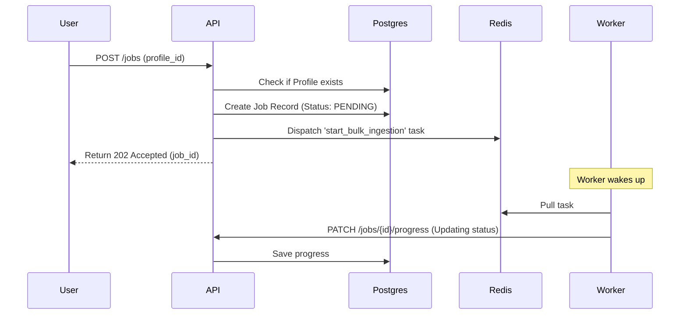

# Platform API Architecture

This document explains the internal design and data flow of the `platform-api` service.

## The "Control Plane" Concept
The `platform-api` acts as the **Control Plane** for the entire E-commerce AI Platform. It does not perform heavy data processing itself; instead, it manages the configuration (Connectors) and schedules work (Jobs).

## System Components

### 1. FastAPI (The Interface)
- Handles incoming HTTP requests from the UI or external systems.
- Validates input using Pydantic schemas (`src/api/schemas.py`).
- Manages authentication and authorization (future enhancement).

### 2. PostgreSQL (The State Store)
- Stores **Connector Profiles**: Configuration for external data sources (Shopify, Amazon, etc.).
- Stores **Ingestion Jobs**: The history and current status of data sync operations.
- The schema is automatically provisioned on startup in `src/main.py`.

### 3. Redis & Celery (The Orchestrator)
- **Redis**: Acts as the message broker between the API and the Workers.
- **Celery**: Dispatches tasks to background workers.
- When a job is "triggered," the API sends a task named `start_bulk_ingestion` to Redis.

## Data Flow: Triggering a Job

## Data Access Layer
Currently, the API uses **Raw SQL** with `psycopg3` for maximum performance and simplicity during the initial build phase. 

- **Database Client**: Managed as a singleton in `src/database.py`.
- **Parameterization**: All queries use `%s` or `%(key)s` placeholders to prevent SQL Injection.
